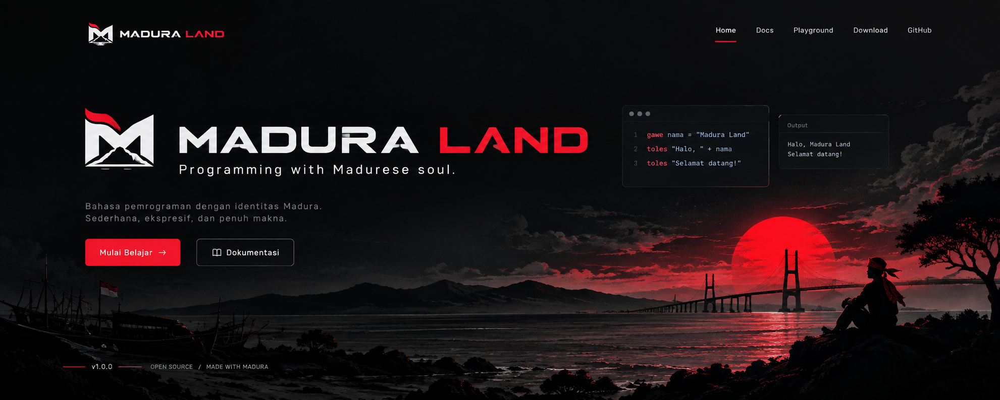

<p align="center">
  
</p>

<h1 align="center">Madura Land</h1>

<p align="center">
  Basa pemrograman eksperimental dengan sintaksis yang terinspirasi dari Basa Madura.
</p>

<p align="center">
  
  
  
</p>

---

## Tentang

**Madura Land** mengeksplorasi rasanya memprogram ketika sintaksisnya membawa
karakter basa daerah. File `.madura.l` ditulis dengan kata kunci seperti
`gawe`, `toles`, `jika` / `lain` / `samporna`, dan `fungsi` / `balek`.

```
gawe nama = "Madura Land"

toles "Halo, " + nama
```

Ini proyek eksperimental — sintaksis dan tooling di sekitarnya masih terus
berkembang. Lihat [Changelog](#) untuk riwayat perubahan lengkap.

## Tech stack

Website ini dibangun dengan:

- **[Vite](https://vitejs.dev/)** — build tool & dev server
- **[React](https://react.dev/)** + **TypeScript** — komponen & tipe
- **[Tailwind CSS](https://tailwindcss.com/)** — styling
- **[React Router](https://reactrouter.com/)** — navigasi antar halaman

## Menjalankan secara lokal

```bash
# 1. Install dependencies
npm install

# 2. Jalankan dev server
npm run dev

# 3. Build untuk produksi
npm run build

# 4. Preview hasil build
npm run preview
```

Dev server berjalan di `http://localhost:5173` secara default.

## Struktur proyek

```
madura-land/
├── public/
│   ├── assets/          # logo, banner, favicon, OG image
│   ├── favicon-16.png
│   ├── favicon-32.png
│   └── apple-touch-icon.png
├── src/
│   ├── components/      # Navbar, Footer, Hero, CodeWindow, dst.
│   ├── pages/            # Home, Docs, Examples, Changelog, Kontribusi
│   ├── lib/
│   │   └── interpreter.ts  # interpreter prototipe untuk Playground
│   ├── App.tsx
│   ├── main.tsx
│   └── index.css
├── index.html
├── tailwind.config.js
├── vite.config.ts
└── package.json
```

## Halaman

| Halaman | Path | Isi |
|---|---|---|
| Beranda | `/` | Hero, sintaksis, playground interaktif, rilis |
| Dokumentasi | `/docs` | Instalasi, sintaksis dasar, referensi CLI, pencarian |
| Contoh | `/examples` | Kumpulan program `.madura.l` |
| Changelog | `/changelog` | Riwayat perubahan versi |
| Kontribusi | `/kontribusi` | Cara melaporkan bug & alur Pull Request |

## Kontribusi

Lihat halaman [Kontribusi](/kontribusi) di website, atau `src/pages/Kontribusi.tsx`
di repo ini untuk panduan lengkap — melaporkan bug, mengusulkan perubahan
sintaksis, dan alur kerja Pull Request.

## Lisensi

MIT — bebas dipakai, dimodifikasi, dan dikembangkan lebih lanjut.

---

<p align="center">
  <sub>© 2026 Proyek Madura Land — dibuat dengan jiwa Madura.</sub>
</p>
